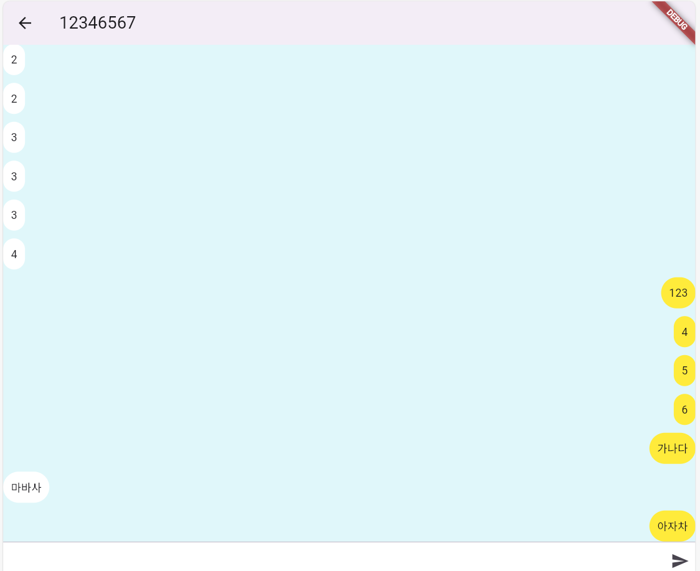
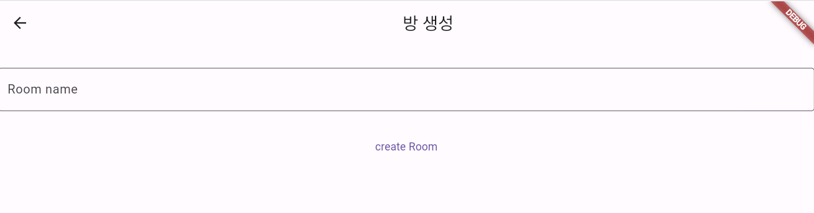

# flutter-chatting

## 프로젝트 소개

상대방과 실시간 통신하는 채팅 프로그램

## ⚙ 개발환경

###  💻 Frontend

---

-   #### **Language: `Dart`**
-   #### **Framework: `Flutter`**

### 🌐 Backend

---

-   #### **Language: `Java`**
-   #### **Framework: `Spring Boot`**
-   #### **Socket 통신: `netty-socketio(Socket.io기반)`**

## 메인 화면

    

## 📌 상세 기능

#### 채팅 방 생성

    

-   채팅 방 생성을 위해 방 이름을 작성
-   Rest API 통신을 통해 서버에 전송되어 방을 생성

#### 채팅 방 참가

-   생성된 방을 리스트로된 버튼을 클릭하여 해당 방에 입장
-   방을 입장하면 서버와 실시간 Socket 통신을 실시한다.

#### 채팅 메시지 전송

-   입력창에 메시지 내용을 입력한 후 전송 버튼을 클릭시 서버에 전송
-   Socket.io 통신을 통하여 메시지를 전송한다. 데이터 형식은 JSON이며 룸 이름, 메시지 내용, 소켓ID 3가지로 구성되어 있다.
-   자신이 보낸 메시지를 클라이언트 UI(전송)에 표시한다.
-   서버에서 받은 메시지를 자신을 제외한 같은 룸에 있는 모든 클라이언트에게 메시지를 전송한다.

#### 채팅 메시지 수신

-   각 클라이언트는 받은 메시지를 메모리에 저장하고, 해당 메시지를 클라이언트 UI(수신)에 표시한다.
